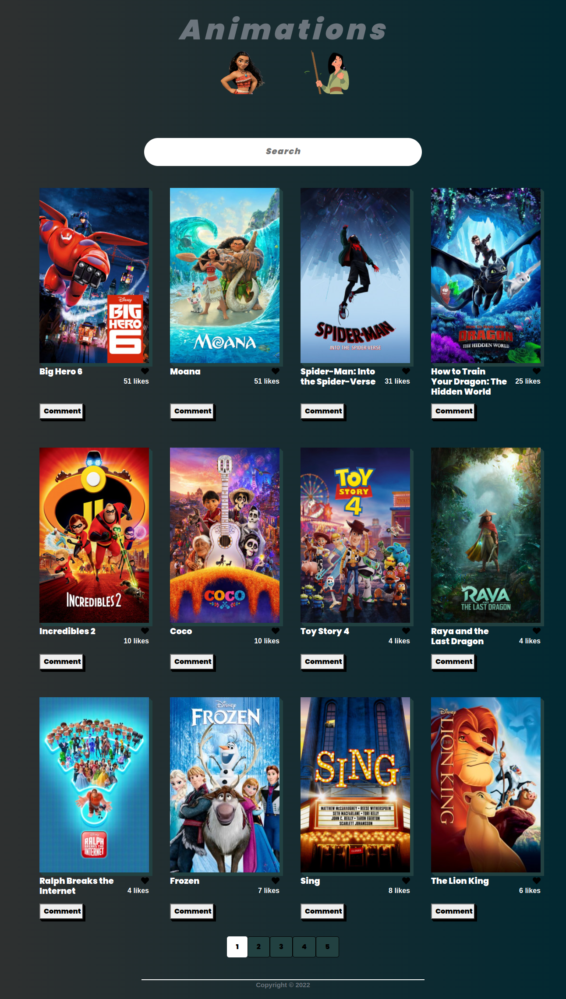
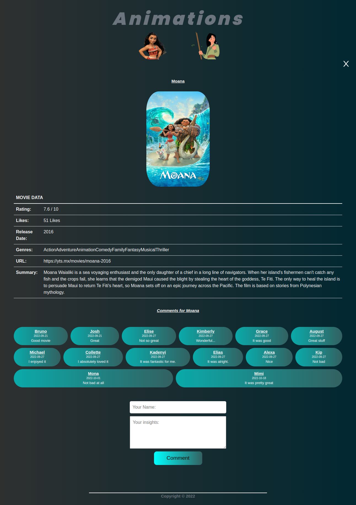

# Project Name: Movie-Database-React-Redux

> Description of the project: A web application that displays animation films. The film data is fetched from an api and displayed on two predominant pages: homepage and comments section. The webapp allows the user to like and comment on each movie, of which the data is stored in two separate involvement apis.


## Built With

- Major languages: HTML | CSS | JavaScript 
- Library/Framework: Reactjs | Redux 

## Live Demo
[Live Demo Link](https://animation-database.netlify.app/)


## Preview





## Getting started

#### Clone this repository

```bash
$ git clone https://github.com/TracK92/Movie-Database-react-redux.git
```

#### cd into directory
```
$ cd <relative-path>/space-travellers-hub/
```

#### install dependencies
``` run 
$ npm i
```
#### run project
```
$ npm start
```

## Authors

👤 **Tracey Kadenyi**

- GitHub: [@TracK92](https://github.com/TracK92)
- LinkedIn: [Tracey Kadenyi](https://www.linkedin.com/in/tracey-kadenyi/)

👤 **Ernest Anyewe Adonu**

- GitHub: [@principlebrothers](https://github.com/principlebrothers)
- LinkedIn: [Ernest Anyewe](https://www.linkedin.com/in/ernest-anyewe-adonu)

👤
## 🤝 Contributing

Contributions, issues, and feature requests are welcome!

Feel free to check the [issues page](../../issues/).

## Show your support

Give a ⭐️ if you like this project!
